# Unit A
[Back to Main](../README.md)  

`IMPORTANT NOTE: THIS README SERVES AS A CHEAT SHEET FOR ME, IF YOU WANT TO UNDERSTAND THE TECHNIQUES I HIGHLY RECOMMEND TO WATCH THE LECTURES!`  

Our robot is a wheeled robot with a 2D LIDAR scanner on top of it, which doesn't cover 360 degrees, there is a dead region.
There are also 2 wheel encoders (`wheel encoder counts number of ticks for every full rotation where one tick corresponds to distance **d** that the robots moves`) one for the right wheel and one for the left one, to be used later in estimating the robot state. `NOTE: If the two wheels rotate at different rates, then the robot takes turns`

## How to represent the robot motion? Motion model
There are two cases our robot can take during its movement.
1. Circular movement
2. Straight movement

Suppose our robot moves from point **p** to a new point and it's required to calculate the new state of our robot given the distance the robot moves in the form of motor ticks.
```
distance = motor_ticks * ticks_to_distance_ratio
```
`You can calculate the ratio by moving the robot forward n distance units and devide the measured number of ticks by n`
### Circular movement
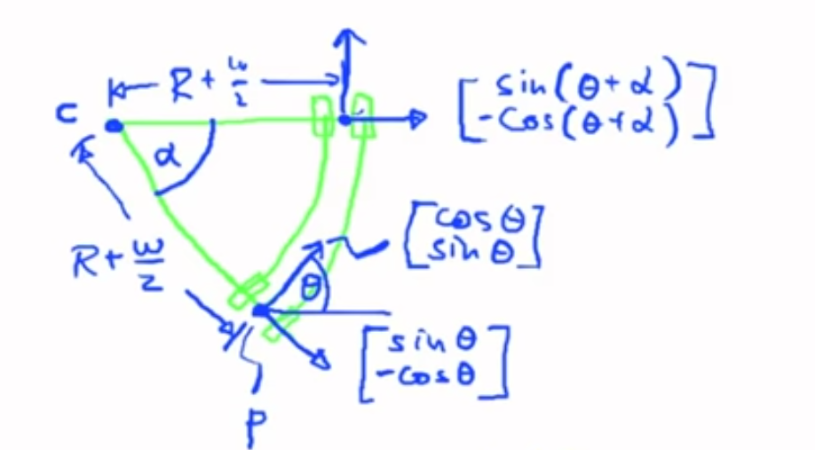
where:
* **c** is the center that the robot turns around.
* **R** is the radius of the circular path.
* **w** is the robot width.
* **theta** is the heading angle.
* **p** is the reference point (the middle of the robot width).
* **alpha** is the rotation angle.  

`REMEMBER: the length of an arc given its angle theta is = theta(in rad) * R`

using the arc length formula we can calculate the radius of the circular path.  
since the robot takes turn, then the motor ticks of the right wheel encoder is different from that of the left wheel encoder, this can be used to calculate the rotation angle.
so till now we have:  
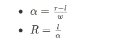  
where 
- r ⇒ length of the circular path of the right wheel
- l ⇒ length of the circular path of the left wheel
- w ⇒ width of the car [calibration parameter]  

we can't directly calculate the new coordinates, we need first to calculate the coordinates of the center that the robot turns around. This is done by the help of unit vectors.
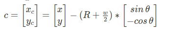  
where x and y are the coodinates of point **p** in the image (where the robot starts moving).

Using the same methodology we can calculate the robot new state as:
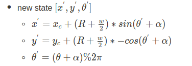

---
### Straight movement
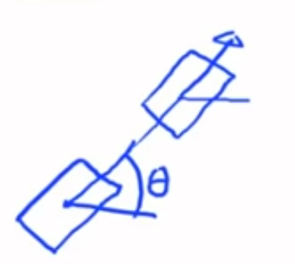  
In this case, both wheel encoders gives the same readings and since there is no turns, the robot new state can be calculated as follows:  
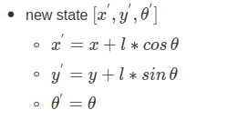  
where l is the measured distance the robot moved.

---
## Scanner Data

At this point we still don't have a good trajectory of the robot  
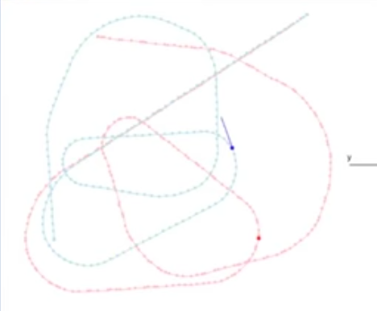  
The actual trakectory of the robot is the red dotted trajectory while the green one is the computed trajectory using motor ticks.  
It is not sufficient to use only the motor ticks, we need to use scanner data to correct the trajectory.  
This is done by calculating the detected cylinders position and assign them to the nearest possible landmark in the given map.  
But first let's understand how the cylinders are detected.  
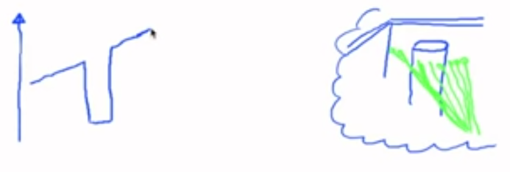  
when there is a cylinder in front of the robot, the LIDAR laser beams will be as shown in the image (the green beams).  
If we plot the laser scans we will get two edges (positive & negative) for each cylinder, which can be detected as high +ve derivative and high -ve derivative. the numeric derivative formula will be used 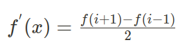  
but due to measurement errors we need to set a threshold to derivatives that will be considered as a left/right edge of a cylinder.  
BUT
There might be a situation where the laser scans hit two cylinders with no gap which will result in two consecutive left edges as follows:
  
To work around this problem, can compute the average depth and the average ray that indicate where the cylinder is (marked with pink) 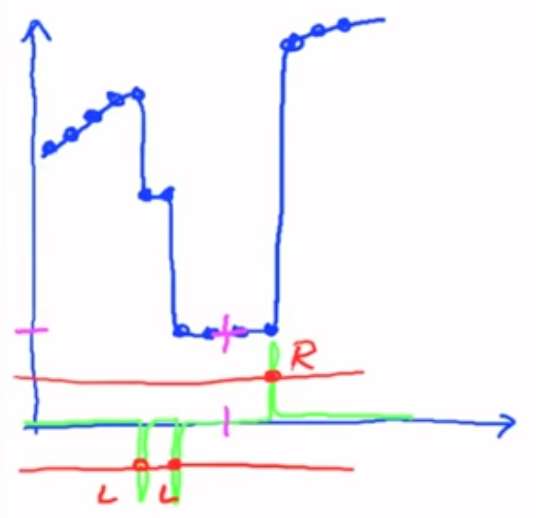  
How?
```
while (on cylinder){
    1. calculate derivative 'd'
    2. if 'd' <= -thershold then reset counters
    3. else update counters [number of rays, sum of rays value, sum of depths] if ray > some_threshold.
    4. if 'd' > threshold then this marks the end of the cylinder => compute average depth & average ray value.
}
```

## Final Result
After going through all these steps we end up with this trajectory (that could be improved) of our robot as follows:
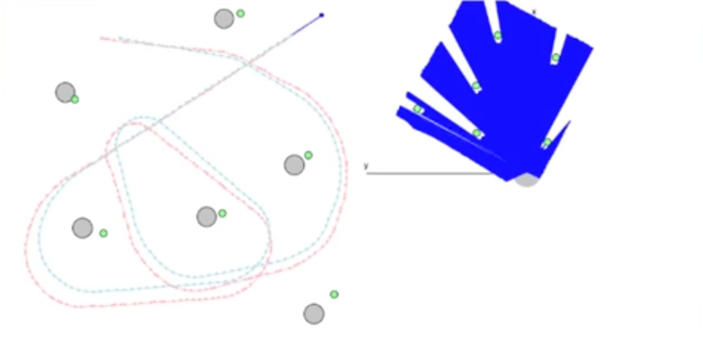