# Unit B
[Back to Main](../README.md)  

`IMPORTANT NOTE: THIS README SERVES AS A CHEAT SHEET FOR ME, IF YOU WANT TO UNDERSTAND THE TECHNIQUES I HIGHLY RECOMMEND TO WATCH THE LECTURES!` 

## Where are we?
  

using motor ticks, we managed to compute the robot trajectory but it isn't accurate enough, in addition to detecting the cylinders in the scene. where the green points are the detected cylinders and the grey circles are the actual landmarks.    
BUT the problem is at some point when the robot takes a turn, things start to go wrong!  

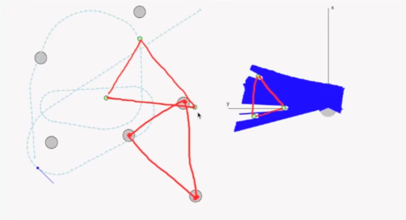   

we can see from the image, that the robot detects 3 cylinders but didn't project them well on our map (the triangle with green vertices *vs*  the traingle with grey vertices)  
so we need to find the transformation to best match these traingles together, and since the detected cylinders position is w.r.t the robot position, we can use the computed transformation to find a better estimate for the robot actual position!  

## Similarity Transform
First we need to get point pairs of (detected cylinders, actual landmarks) so that we assign each cylinder to its closest landmark.  
Then by applying similarity transform technique we can find the transformation equation to match these two scenes. This transformation consists of rotation, shifting and scaling.  
`And Dut to the noise we should find the best transformation that minimizes the sqaured difference between the points from the two scens (A.K.A Least Squares).`  

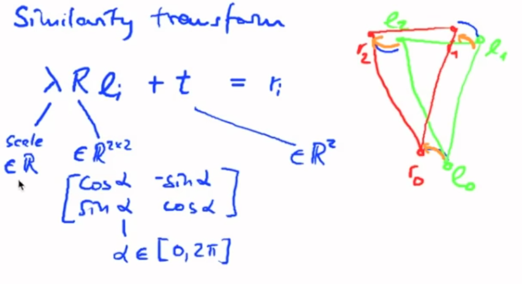   
where:
- *lamda* is the scale factor
- R is the rotation matrix
- t is the shifting
- l is the set of points of one scene
- r is the set of points of the other scene  

The problem is that the rotation matrix is non linear, so this appraoch is iterative, but there is another approach.  
First we compute the center of mass of each set of points (left , right), and then subtract them from the original points to get reduced coordinates.   

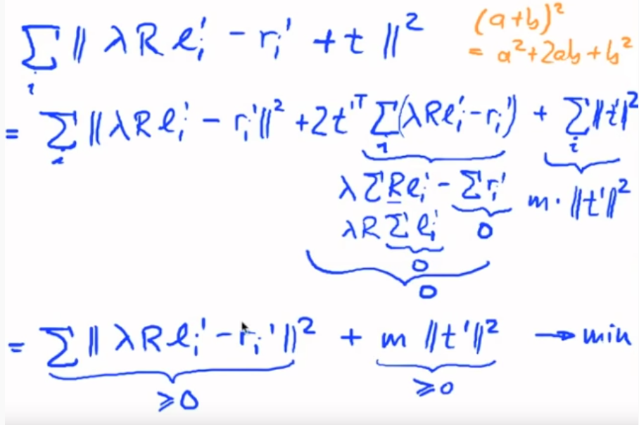  
where:
- l prime is reduced points from the first scene
- r prime is the reduced points from the second scene
- `t prime = lamda * R * l_bar - r_bar + t`,  where l_bar and r_bar are the centers of mass.

we end up with two positive terms added together and the goal is to minimize them, this can be done by setting each term = 0
**Second Term**  

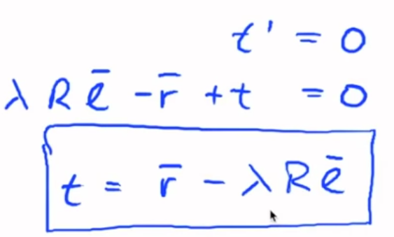  
we need to compute *lamda* and  *R*, see the image below.    

**First Term**  
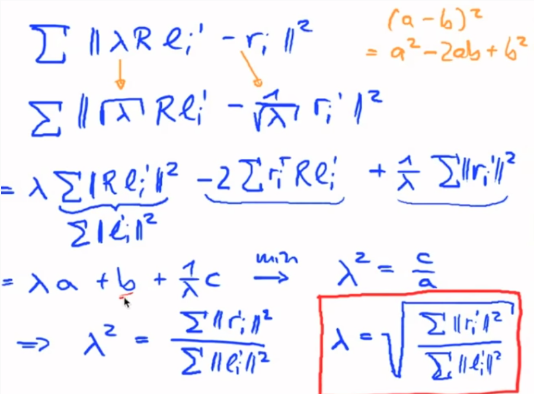   

now it's left to compute *R*, and this can be done by **maximizing** the seconds term in the third line in the image above (the term with '-' sign). Why maximizing? because of the negative sign. see the image below.  

**Find R**  
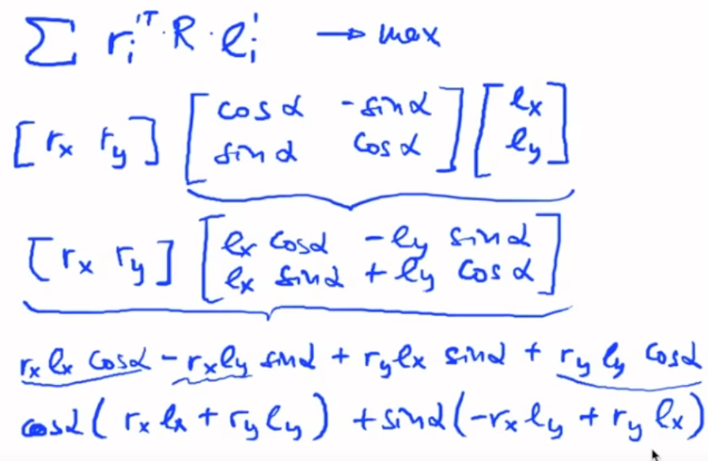   

let's write them in more formal way   

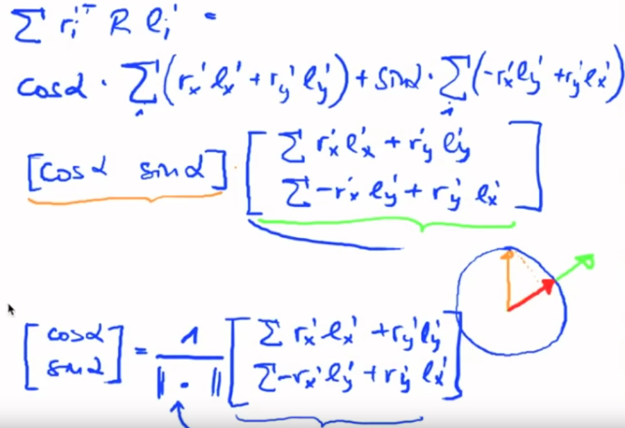   

The `[cos(alpha) sin(alpha)]` is the unit vector  
and in order to maximize the total term, we need to find the unit vector in the same direction as the other vector (the one with sums, that's underlined by the green line)  
and to compute the unit vector we need to devide the vector by its norm which is represented by the equation at the bottom of the slide.  

## Similarity Transform Steps  
`Note the variables name match those used in the explanation images`  

```
    def simliarity_transform(l, r):
    1.    l_bar = l.sum() / len(l)
    2.    r_bar = r.sum() / len(r)
    3.    l_prime = [l_i - l_bar for l_i in l]
    4.    r_prime = [r_i - r_bar for r_i in r]
    5. # Compute the sums
    6.     for i in range(len(l)):
    7.          cos_sum += r_prime[i].x * l_prime[i].x + r_prime[i].y * l_prime[i].y
                sin_sum += r_prime[i].y * l_prime[i].x - r_prime[i].x * l_prime[i].y
                r_sum += r_prime[i].x**2 + r_prime[i].y**2
                l_sum += l_prime[i].x**2 + l_prime[i].y**2
    8. # compute transformation terms
    9.    lamda = sqrt(r_sum / l_sum)
    10.   cos = c_sum / sqrt(cos_sum**2+sin_sum**2)
    11.   sin = sin_sum / sqrt(sin_sum**2+cos_sum**2)
    12.   t = r_bar - lamda * [[c, -s], [s, c]] * l_bar 
```
### Correct robot pose  
as mentioned earlier, we can apply the same transformation on the robot pose to correct and get better estimate of its state and the result is a globally correct trajectory but it's very jagged, as follows:  

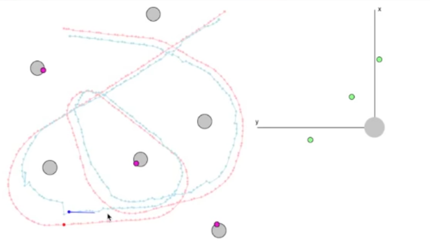  
  
---
## ICP (Iterative Closest Point)
The problem we countered is that at some points when there are few features in the scene (detected cylinders < 2) our robot may get lost and the trajectory gets very jagged, although there are many measurements we don't use yet that could improve our situation!  
we can use the detected points to be on the fence of the arena and match them to the closest points on the arena borders then we compute the transformation terms required to match those two scenes.   

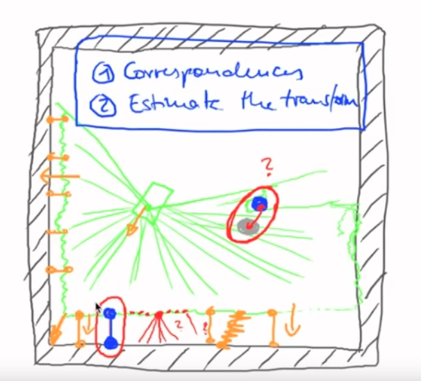   

we need to set a threshold of the accepted distance between the points and the fence and the situation becomes as follows:   

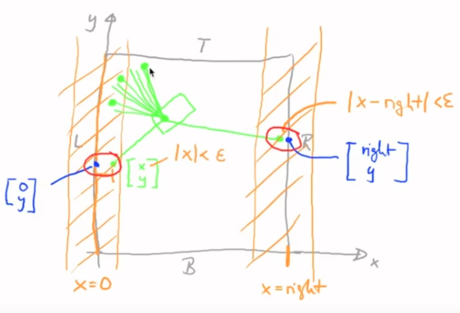   

**Problem?**  

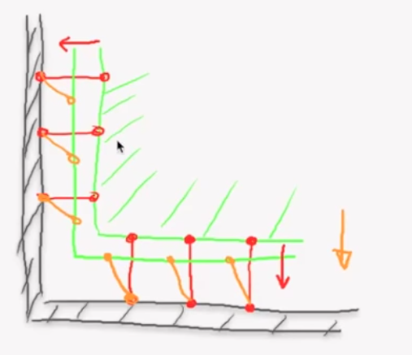   

if we first compute the transformation terms and moved the red points to the orange points, this affects the trajected points.  [Please look at the image] If the robot moved down this increases the distances between the left points and the fence, while moving to the left increases the distance between the bottom points and the fence.  
Solution?  
We need to find the best transformation by applying the algorithm for number of iterations n and combine all found valid transformations, which is our ICP (iterative closest point) approach.
```
1.    transformation = trivial transformation
2.    for i in range(iterations):
3.      get_corresponding_points_on_wall()
4.      new_transform = compute_transformation()
5.      if new_transform is valid:
6.          transformation = combine_transformations (new_tranform, transformation)
7.    return transformation
```

## Final result
We end up with a globally correct trajectory and almost smooth but this appraoch has a high cost because we use very large number of points to compute transformation of our scene points.  

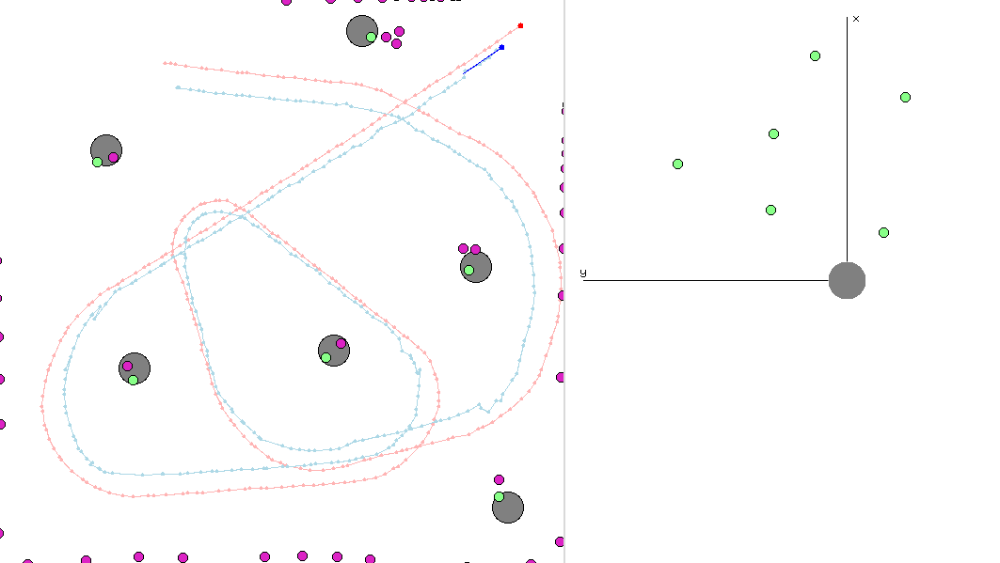   
