# Unit D

[Back to Main](../README.md)  

`IMPORTANT NOTE: THIS README SERVES AS A CHEAT SHEET FOR ME, IF YOU WANT TO UNDERSTAND THE TECHNIQUES I HIGHLY RECOMMEND TO WATCH THE LECTURES!`   

## Where are we?
Unit C introduced the kalman filter for 1D which assumes that the distribution is a gaussian with mean=Mu and variance=Sigma^2. But our state most probably not in 1D, so we need to extend the filter to multidimenions and hence we need to explore the multivariate gaussian distribution.  

## Multivariate Gaussian
Let's move from our 1D gaussian to 2D gaussian  
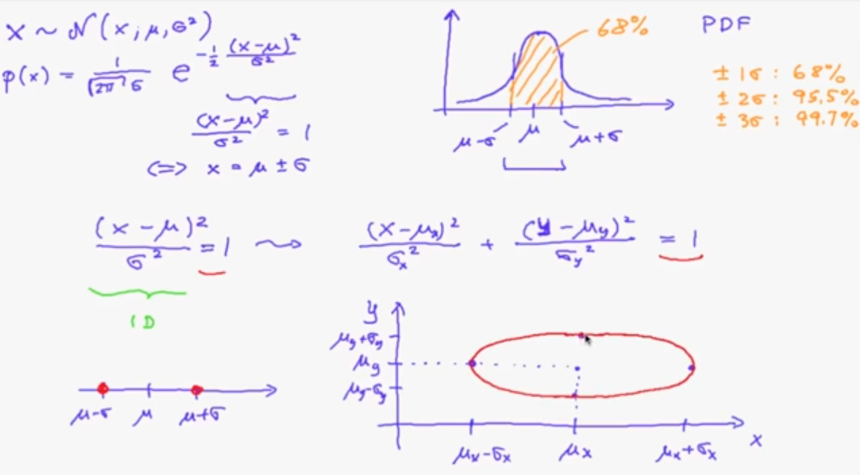   
for a 1D gaussian, by setting `(x-mu)^2 / Sigma^2` = 1, this computes the probability of being 1 sigma around the mean value.  
Mapping this concept to 2D gaussian, we now have x and y, so by setting the sum of the two terms = 1, this is fullfiled by the points laying on the ellipse (red curve in the image).  
the vector form of this term is as follows:   
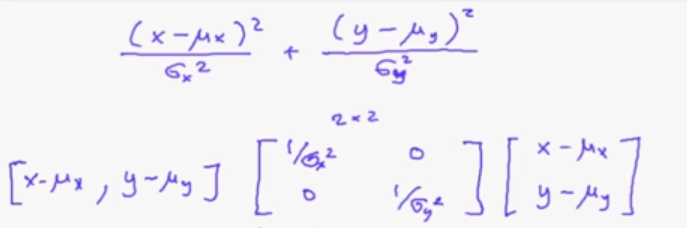  
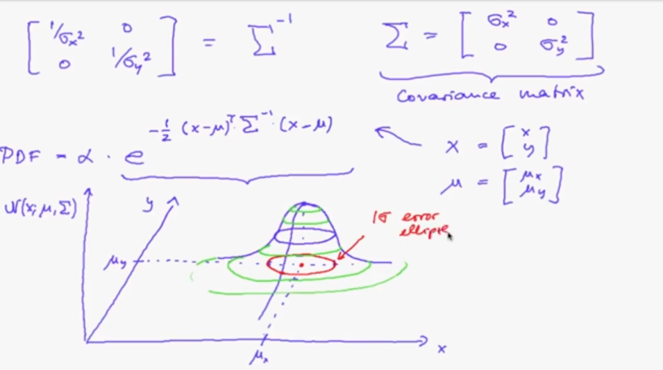  

**Correlated/Uncorrelated variables**  
If the variance matrix is a diagonal matrix => uncorrelated variables   
IF the off-diagonal values are non-zeros => correlated variables and the main axes don't coincide with maximum/minimum points along the axis, and to draw this ellipse an eigen_value-eigen_vector decompostion of the variance matrix 'Sigma' (real and symmetric matrix) is required as shown in the image:  
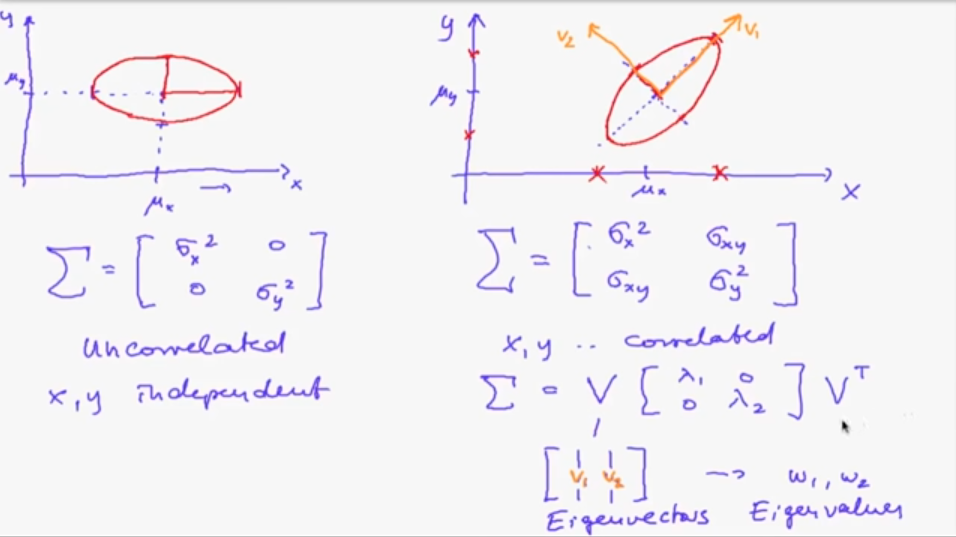    

So the PDF for the mutlivariate Gaussian is:  
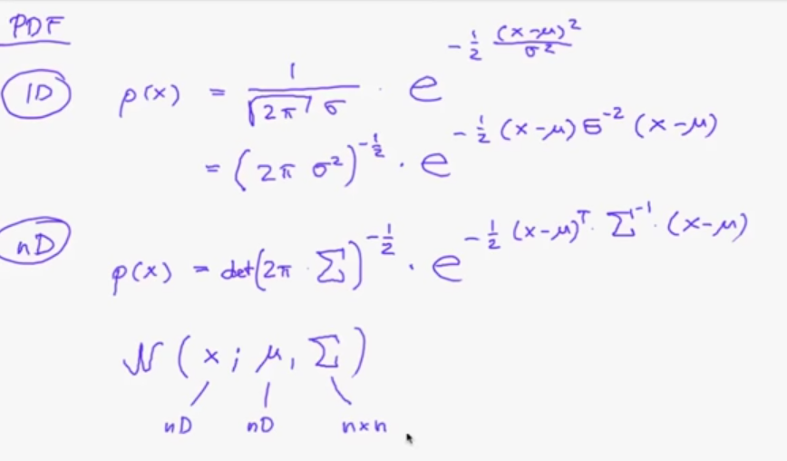  

## Kalman Filter
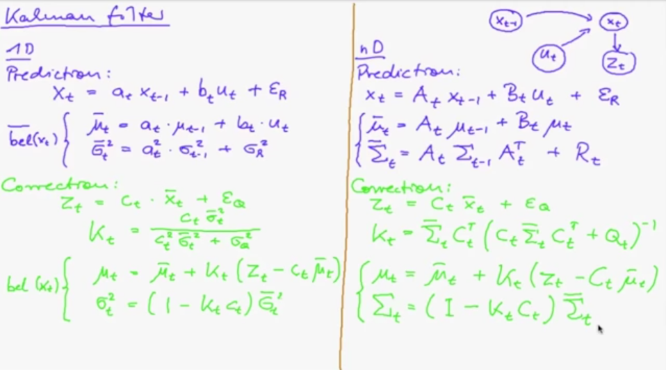  
where:  
- A_t a matrix that describes how the state evolves from t-1 to t.
- B_t a mtrix that describes how the control u_t changes the state from t-1 to t.
- C_t a matrix that describes how to map the state x_t to an observation z_t.
- Q_t covariance matrix of measurement => describes the measurement noise.
- R_t covariance matrix of transition => describes the movement noise.  
notice the similarity between the derviations in 1D and in 2D.  
## Extended Kalman Filter
**Remember Our motion model**   
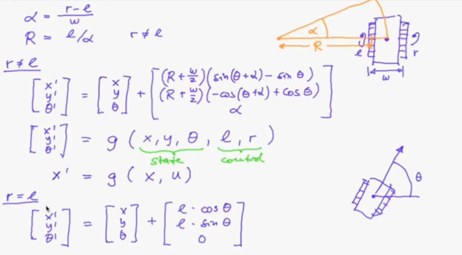   
In this case, our function 'g' is non-linear while the kalman filter works with linear models.  One way to proceed is to linearize our function first and use it in our kalman filter, This is known as the Extended Kalman Filter.   
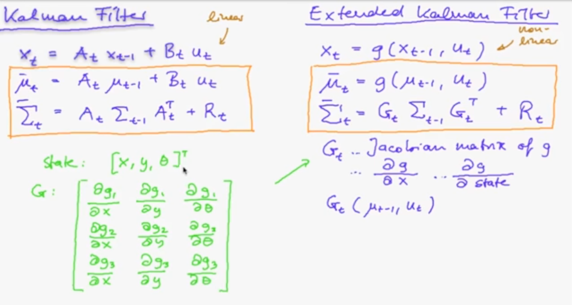  

For linearization, we use the jacobians.  so we replace matrix A with the jacobian of the non-linear function 'g'. what's the jacobain of function 'g'?  
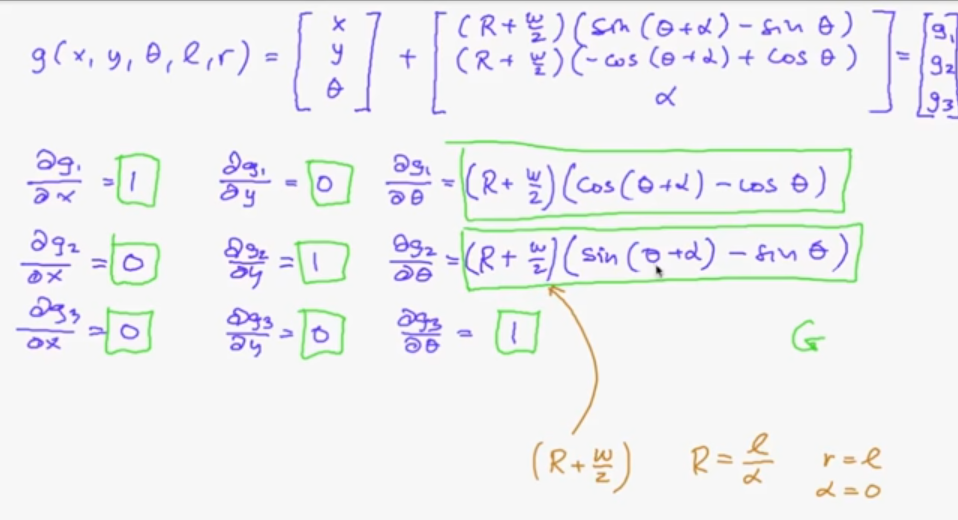   
These formulas are okay in case r != l, but if r = l then alpha will = 0 and hence R-> Infinity. As a solution we apply L'Hopital and the Jacobian will be:  
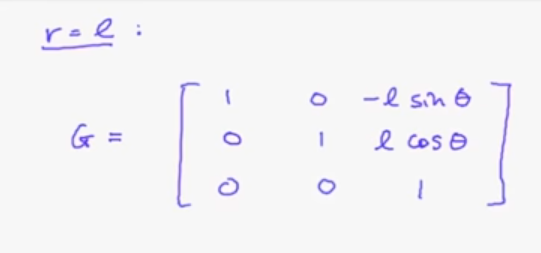  

**What about matrix R?**  
As mentioned earlier R is the covariance matrix of transition represnting the noise from the control, and it also will be linearized using jacobians ( matrix V will be the annotation of the jacobian)  
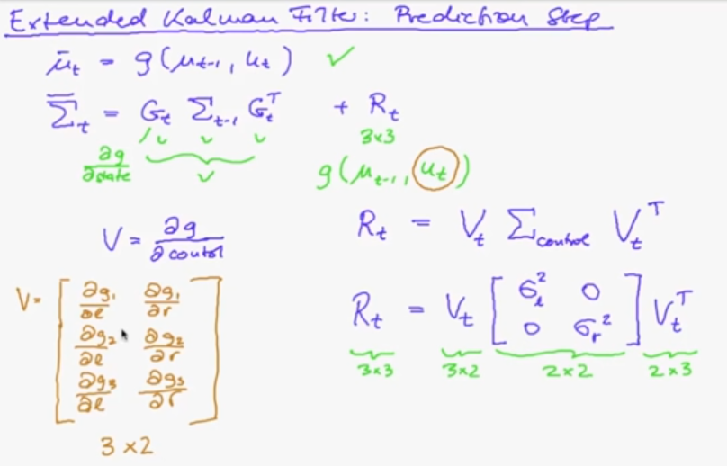   
**How to compute Sigma_l^2, Sigma_r^2?**   
They represent the variance in the control values for left wheel and right wheel, so for example the left variance should be propotional to the value of the left command (how much should the wheel moves) and also the difference between the left command and the right command. so we can compute them as:  
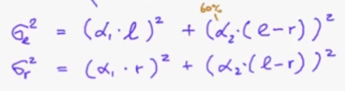  
where alpha_1 and alpha_2 are some factors.  
**what's the jacobain?**   
where r!=l
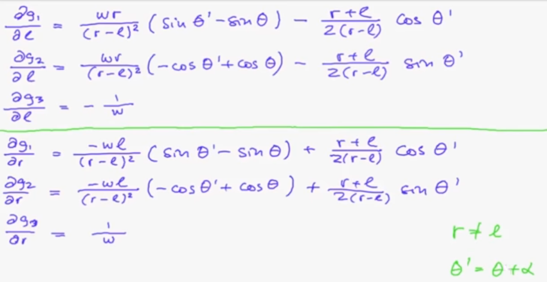   
where r = l  
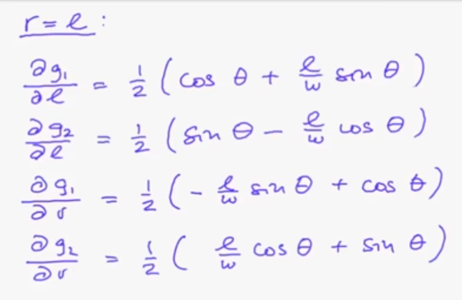  

**Correction Step**  

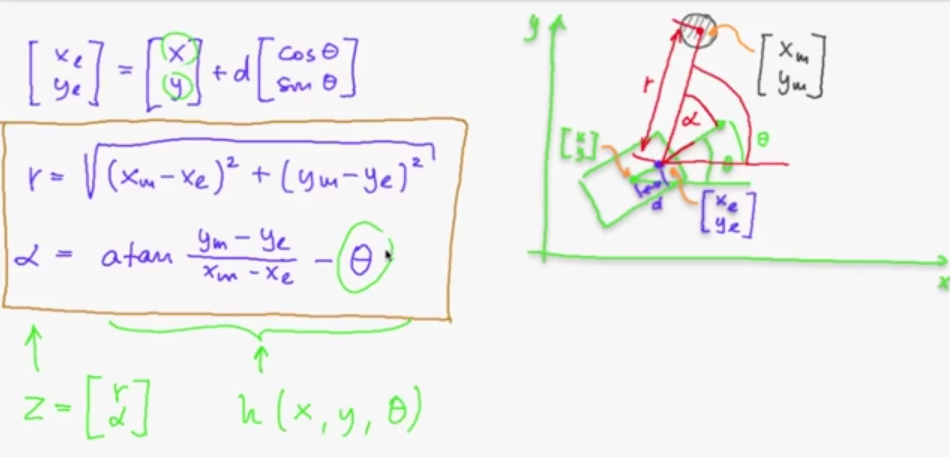  
In our case the LIDAR coordiantes are displaced from the robot coordinates by distance 'd', but the LIDAR measurements are w.r.t the LIDAR coordinates, so we need to transform them.  
If the robot state is [x, y, theta] and the measured cylinder is at [x_m, y_m] with angle alpha from the robot heading vector.  then the distance between the robot and the cylinder is 'r' and the angle is 'alpha', and they are computed as shown in the previous image.  
Just like the prediction step, the measurement function is non-linear and linearization is performed with jacobians.  

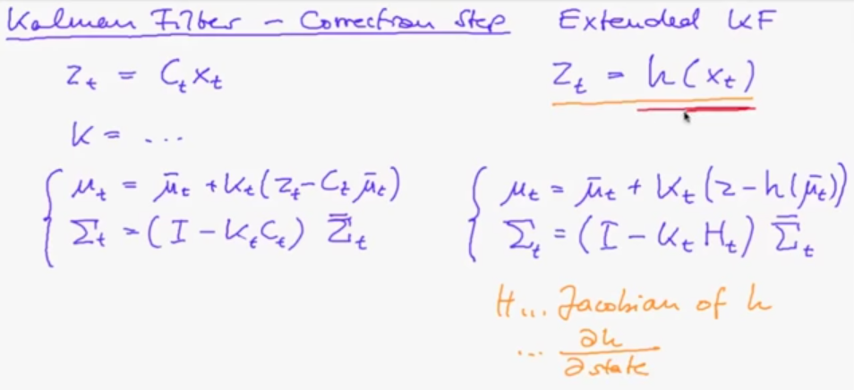  

What is the jacobian in this case?   
1. partial derivative of the range 'r' w.r.t the state  
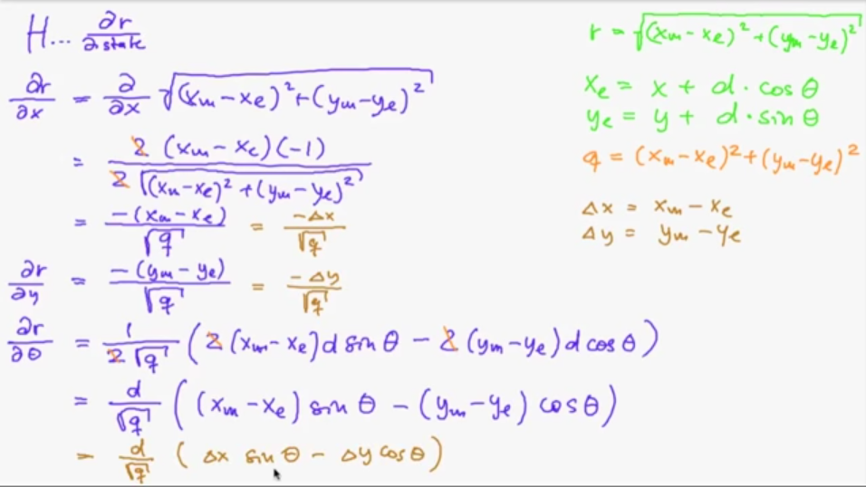  
2. partial derivative of the angle 'alpha' w.r.t the state  
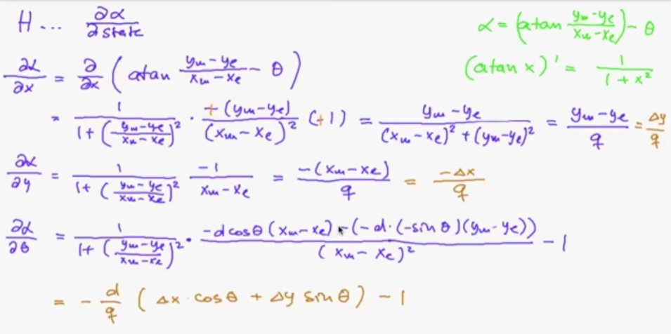  

## Steps in General 
1. Setup the model for the system transition.
2. Setup the model for the system measurement.
3. Derive all the Jacobian matrices required for the predtction/correction steps of the filter.  
Finally in practice, the popular problem is to find good values for the various covariance matrices in the filter

## Final result 

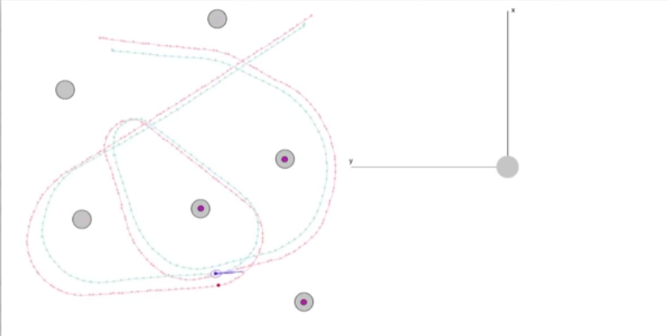  
