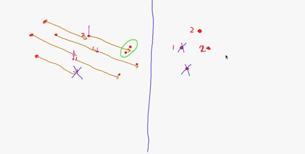

# Unit E

[Back to Main](../README.md)  

`IMPORTANT NOTE: THIS README SERVES AS A CHEAT SHEET FOR ME, IF YOU WANT TO UNDERSTAND THE TECHNIQUES I HIGHLY RECOMMEND TO WATCH THE LECTURES!`   

## where are we?
As discussed in Unit C/D, we represent the uncertainty in our robot state by probability distributions and introduced the bayes filter which mainly consists of two steps:  
1. Prediction Step [with convolution] (using motion model & control commands)
2. Correction Step (using measurement)  

And there are two cases for our distribution:  
| Discrete      | Parametric |
| :--------:    | :--------: |
| Where we use discrete approximations of the robot state| Where we assumed that the belief is normally distributed and represented with (Mu, sigma^2)|
This lead to the histogram filter  | This lead to the kalman filter|
| Any distribution is possible (multiple peaks are allowed)| Only one Peak (Unimodal)|
|There is a tradeoff between the approxiamtion and the computational cost|More efficient because it deals with only 2 parameters (Mu, sigma^2) and if the distribution is indeed a Gaussian then the representation is way more better and exact|
---
**The problem?**  
At the beggining our robot doesn't know where he is, we didn't encounter this issue because we started at a known position in the map, but in case we don't know and our map is a square given that we started at a corner, we have 4 possible sub-areas and our distribution in 2D will be as follows (at the bottom right corner of the image):  
  

## Localization Challenges
- Position Tracking: (implemented in previous units)
  - we start with a known intial pose 
  - the belief distribution is a unimodal distribution (most probably a Gaussian)
- Global Localization:
  - we start with unknown intial pose
  - the belief distribution is not a unimodal
- Kidnapped robot:
  - global localization
  - recovering from localization failure (when the environment changes or suddenly the robot's position is changed in the map, or ..etc)

## Particle Filter
If we want to go for a kalman filter for localization then our distribution should be a Guassian but intially we don't know where we are!  
we can assume a gaussian distribution with a large variance.  
kalman filter uses measurements to correct the robot state, in the case of high variance the measurements might not match the actual landmarks and there would be wrong assignments which in turns leads to mistakes in the correction step and hence the kalman filter won't be efficient at all!  
**How to solve this?**  
what if we consider multiple possible positions and try to match the measurements to the landmarks for each position, it's more probably that one of those positions is close enough and hence the landmark associations would give the best result and improve the guess of the robot pose.  

  

**Properties**
- our belief is a set of random samples 
- the distribution is approximate and non-parametric
- hence it's able to represent distributions with multiple modes (peaks)  

### Prediction Step

   

For every particle in the set:
1. get the predicted position according to previous position and control.  
2. due to noise, the previous step would result in a distribution not an exact point  
3. sample a predicted particle from this distribution
4. at the end, our prediction samples is our new patricle set.  

**How to sample?**  
In kalman filter, we used to compute the predicted state as the output of the function `g(x_{t-1}, u_t)`  
since the movemenet accroding to the control is not accurate, we assume that the control (left control, right control) values are from a normal distribution with `Mu=left,right` control value and variance `Sigma_left^2, Sigma_right^2`   

next we sample from both the left and the right control distributions.  
thsoe samples are used as the control values and passed to the function g.   And the variances are computed as in the image.   

   

### Correction Step  
  

just like kalman filter, the correction step is done by multiplying the probability of observation given a previous state by the probability of the predicted belief normalized by *alpha*  
but now we deal with particles! so the process is as follows:  
1. compute weight for each particle `= the probability of observation 'z' given the predicted particle.`  known as **importance factor**  
2. perform sampling with replacement from the predicted particles with probabilities = weights from the previous step.  known as **importance sampling**  

by doing this, if for example there were 3 predicted particles, but one of them has a high probability, then in the sampling step it might get selected twice, and one of the other two particles will disappear.  

NOTE: Importance sampling is a general technique where weigths are proportional to `target distribution/proposal distribution` and in our case it's `belief(x_t)/predicted_belief(x_t)`

**How to calculate the probability of observation 'z'?**
  
where:
- d is the measured distance
- alpha is the measured bearing
- d_prime is the distance from the landmark
- alpha_prime is the bearing realtive to the landmark    

so for a particle x, we compute probabilities of all the measurements given the robot state = this particle, and multiply all those probabilities to compute the probability of measurements given the current particle.  

**How to sample from the particle set with probabilities = weights?**   
1. First method (not implemented)
   

- pick a random value witin the range [0, sum(weights)]
- get list of cumulative sum of the weights
- using binary search find the index where the random weight exists (or should exist).

2. Second method (implemented)
   

assume we have a pie that is divided into numer of slices = length of our weights, and the i-th slice area is = weights[i], so the sampling process is as follows:  
- pick random index to start with.
- sample a random offset from a uniform distribution within the range [0, 2*maximum_weight].
- check if the offset is within the current weight, then pick the particle associated with this weight.
- otherwise, subtract the current weight from our offset and advance the index.
- repeat the last two steps till you find a match and pick a particle.  
  
this step is performed m times where m is the number of particles we use.

### Denstiy estimation
`Where is the robot ?`  
deriving one or more actual satets of the robot is known as density estimation   
this can be done by one of 4 approaches listed in the image below:  
  
1. **histogram over the state space method**:  
    we represent the possible states with a histogram, and pick the value associated with the peak.
2. **kernel density estimation method**:   
    place a kernel with known size on top of each particle and sum all those kernels up, this will result in an estimate of the overall density.
3. **k-means clustering**:  
   clustering our particles and pick the mean of each cluster.
4. **Gaussian approximation**:  
    assume the particles are from a gaussian distribution and compute the mean and the std from the particles set.  
    but this method only makes sense if the distribution is unimodel (has one peak).

**Problem?**  
till now we perform sampling even if the robot doesn't move, how can this be bad?  
  
where the left half is the case where the robot moves, while the right half is when the robot doesn't move  

In the first case, we start with a set of 4 particles and after moving one step one of them is dropped due to its low weight and one of the particles got sampled twice due to its high weight, but it's okay because after moving another step, the duplicate particles would be mapped to different sampled particles and we dont't lose unique particles.   
while in the second case, the robot doesn't move, and hence the sampled particles aren't distributed, so if a particle disappears then we lose particles from our set.  
so resampling too often may result in losing diversity, while resampling too seldom result in having particles in low probability regions (this is not wanted).  

**Solution?**  
Only resample from the particle set when there is a detected movement in order not to lose our particles.  
OR  
Integerate multiple measurements into weights  [but this is not implemented here]  
till now we compute weights for each step and in the next step we discard them and compute new weights.   
but the solution here is to re-set the weights if resampling took place or integerate them `p(z|x)*weight` if no resampling is required. and the variance of the weights is used to determine whether to resample or not

## Particle deprivation 
  

although this problem is not more likely to happen but it still exists!  
It happens when the picked random values delete all particles near the actual state(the blue points), and we are left with particles that are not close enough to the state (the red points), and those deleted particles can not be resampled later so the estimation may not be accurate enough. This might happen if number of particles is too small!  
the popular solution is to add random particles after resampling and we may have one or more of those random particles close to the actual state and they dominate other particles.  
the drawpack is that by adding random particles we modify the distribution and hence obtain an incorrect posterior.

## Final result
    

even by starting with random particles sampled from a uniform distribution, the robot was able to correct its state quickly and we have a globally correct trajectory.  
