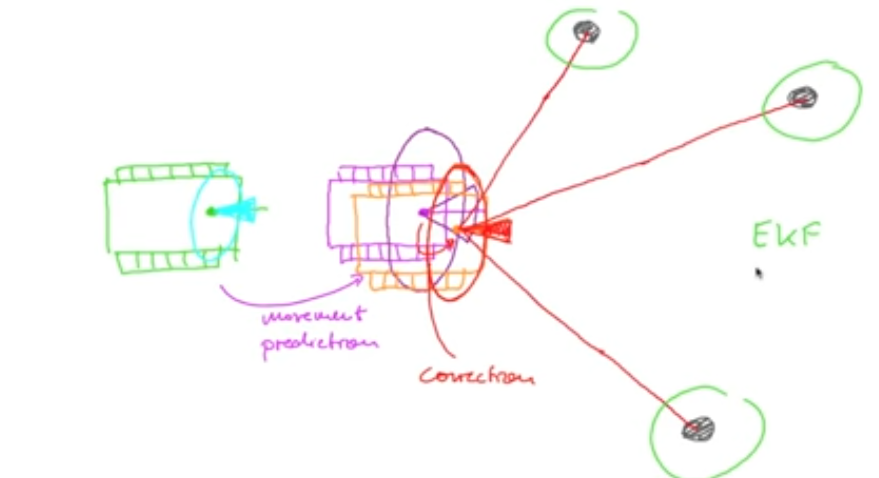
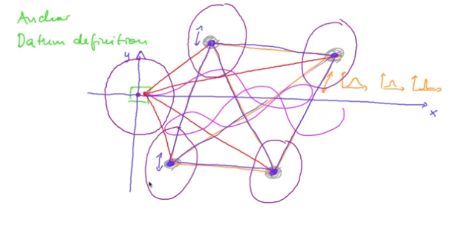
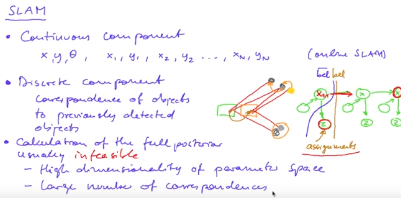
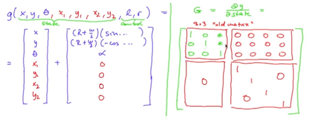
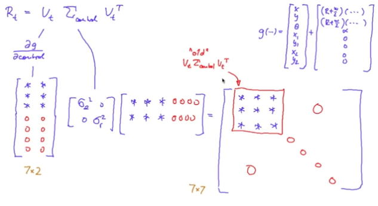
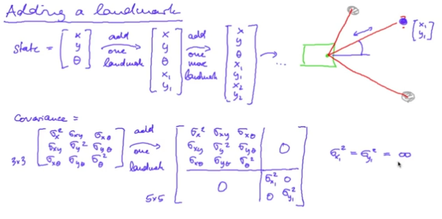
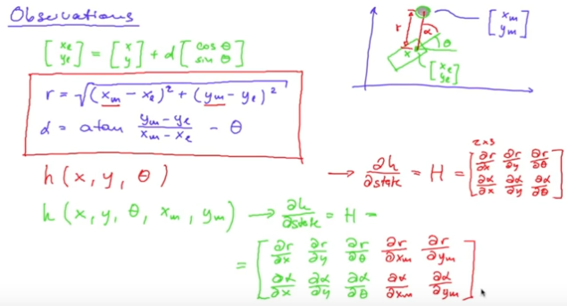
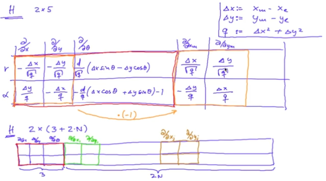
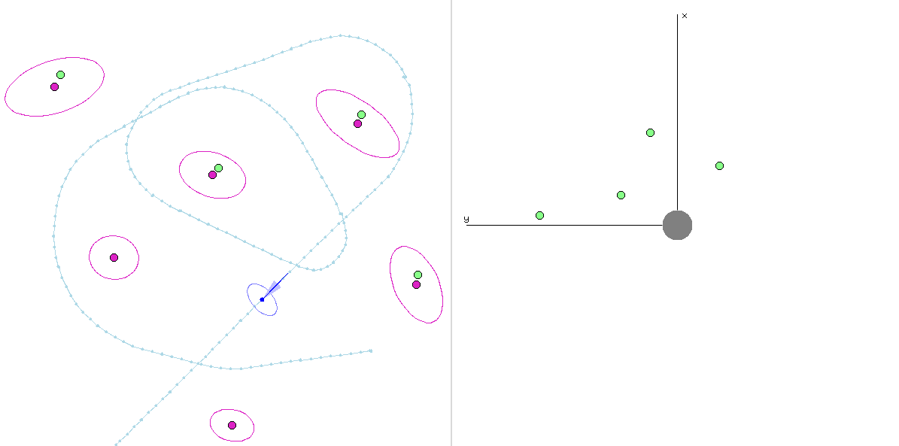

# Unit F

[Back to Main](../README.md)  

`IMPORTANT NOTE: THIS README SERVES AS A CHEAT SHEET FOR ME, IF YOU WANT TO UNDERSTAND THE TECHNIQUES I HIGHLY RECOMMEND TO WATCH THE LECTURES!`

## Where are we?

Till now we are able to estimate the robot state and represent the errors in position and orientation of the robot (colored in green). when the robot moves, the errors increase and this happens in the prediction step (colored in purple), we overcome this problem by using measurements, we assigned them to known landmarks in our map and use those assignments to correct the predicted state and decrease the uncertainty, this is known as the correction step (colored in orange)  

but this depends on known landmarks, what if we don't know the actual position of the landmarks (which is the usual case)?

## EKF-SLAM

Initialy we don't have a map, but the robot will build the map and it can initialize its state to be [0, 0, 0] for x, y and heading relative to the map he is building, whenever the robot moves and measures a landmark, it defines the landmarks position with uncertainty in the world which has its origin at the robot initial position, when the robot moves again and measure those landmarks we use them to correct the robot state and hopefully decrease the uncertainty of the landmark position.  
Hopefully?  
When our robot moves and detectes landmarks, it sets up a link between those landmarks but the distances between the landmarks are not observed directly, instead they are observed through an intermediate point which is the robot position. after moving for a while with all those measurements, the distances between the landmarks become accurately known but we still not sure where the position of the entire structure of those measurements is in our map!  
Since everything is tight to our coordinate system with the robot initial position as the origin, if the error at this intial position is large then the errors of the landmarks position will never be zero or close to zero.  

  

### SLAM Problems

1. Continuous Components: where our state vector includes not only the robot position and heading but also the landmarks position coordiantes x & y, this increases the computation of SLAM (online slam) as the number of landmarks increases.  
2. Discrete Components: where the main problem is the correspondence of objects to previously detected objects. As our robot uses the assignments of the measurements which are discrete in nature to correct its state, if there is an error in those assignments this might lead to large error in the robot state which can not be corrected anymore because we don't keep track of those assignments.  

  

EKF-SLAM is pretty the same as the previously explained EKF, but now our new state vector includes also the landmarks position coordinates x & y.  
So the steps are the same, but we need to define the new functions g, h, and the jacobbians.  

### EKF-SLAM Prediction Step

Note that the movement of our robot doesn't change the landmarks position, so our new motion model function and the jacobbian w.r.t the state is as follows:  
  

we can divide the jaccobian into 4 regions, where the top left one is a 3x3 matrix as the preciously defined jaccobian, the top right matrix is a 2Nx2N zero matrix where N is the numbr of landmarks, the bottom left region is a 2Nx3 zero matrix, and the bottom right region is a 2Nx2N Identity matrix.  

What happens to the movement covariance matrix R?  
  
As the control doesn't affect the landmarks position, our movement covariance matrix will only have the top left 3x3 matrix with non-zero elements and it's the same as previously defined R, while all other values are zeros.  
Note that the matrix is also (3+2N)x(3+2N).  

### EKF-SLAM Correction Step

Again it's pretty the same steps, the difference is in the Jaccobian of the observation function where we augment the landmark coordinates x_m & y_m as they are no more constants.  
**Adding a landmark**  
Whenever our robot observes a landmark for the first time, the observed landmark position coordinates x & y are appended to our state vector, while the covariance matrix should be updated to have 2 more rows & columns representing the covariances between the newely added landmark and the previously observed ones.  
Note that initialy we set the covariances between the added landmark and the old ones to 0 assuming there is no correlation, and the variances of x, y coordinates of the added landmark are set to infinity (in practice a very large value, 10^5 in our case) because we are not sure at all about the observed position since it's the first time.  
  

**Observations**  
In previous units, we treated the landmark coordinates x_m & y_m as constants and hence the jaccobian of the measurement function was like the red-colored jaccobian in the image below, but this assumption is no longer valid as x_m & y_m are now variables so we need to update the jaccobian.  

and the jaccobian will be:  

`Note: our Jaccobian H matrix is a 2x(3+2N) matrix, where again N is the number of landmarks`  

## Final Result

  
where the green points are the detected landmarks and the purple points are the estimated landmarks position with purple ellipses around each representing the uncertainty of the estimated position.  
